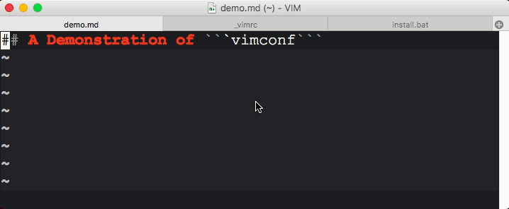

# vimconf
* Super easy, one-click installation
* Extensive supports for multiple programming languages
* Compatibility across platforms and over different versions of Vim

## Installation
### Windows
Download the repository [here](https://github.com/davidxk/vimconf/archive/master.zip) and click `install.bat`. 

### macOS and Linux
```bash
git clone https://github.com/davidxk/vimconf.git
pushd vimconf; ./install.sh; popd
```

## Features
* Brackets auto-pairing
* Space key folding toggle
* Auto spell correction
* Handy customized vim commands
* Supports C/C++, Python, Scala, Markdown, Perl, HTML/XML, etc. 



### Included Plugins
Selected from top 40 plugins in [vim.org](https://vim.sourceforge.io/scripts/script_search_results.php?keywords=&script_type=&order_by=downloads&direction=descending&search=search), managed with pathogen. 

* [ALE](https://github.com/w0rp/ale)
* [a.vim](https://github.com/vim-scripts/a.vim)
* [clang complete](https://github.com/Rip-Rip/clang_complete)
* [Emmet-vim](https://github.com/mattn/emmet-vim)
* [Localvimrc](https://github.com/embear/vim-localvimrc)
* [NERD Commenter](https://github.com/scrooloose/nerdcommenter)
* [NERDTree](https://github.com/scrooloose/nerdtree)
* [pgsql.vim](https://github.com/lifepillar/pgsql.vim)
* [ScrollColors](https://github.com/vim-scripts/ScrollColors)
* [Surround.vim](http://github.com/tpope/vim-surround)
* [tabular](https://github.com/godlygeek/tabular)
* [tagbar](https://github.com/majutsushi/tagbar)
* [taglist](https://github.com/vim-scripts/taglist.vim)
* [pathogen.vim](http://github.com/tpope/vim-pathogen)
* [vim-markdown-folding](https://github.com/masukomi/vim-markdown-folding)
* [vim-scala](https://github.com/derekwyatt/vim-scala)

### Customized Commands
| Command             | Description                                      |
| -------             | -----------                                      |
| **:C**              | Switch between .c file and .h file               |
| **:Cdfiledir**      | Change working directory to location of the file |
| **:Chmod700**       | Make current file executable                     |
| **:Ctags**          | Run ctags recursively in current directory       |
| **:Diff** filename  | Run diff mode on the current file and filename   |
| **:Pickonly** regex | Delete all lines not matching pattern 'regex'    |
| **:Refresh**        | Restart vim on this file                         |
| **:Rerunvimrc**     | Rerun ~/\_vimrc                                  |
| **:Tabr**           | Close tabs to the right                          |


## Try these out ... 
Here is a hint of some of the handy features that you don't want to miss. 

* In insert mode, ```<C-X><C-K>``` for dictionary completion
* In normal mode, ```<C-L>``` for spell correction in text/markdown editing
* In normal mode, ```:Cdfiledir``` to change working directory to enclosing directory of current file
* In normal mode, ```<Space>``` for toggle folding in code editing
* In normal mode, ```<leader>n``` to change color scheme
* In normal mode gVim, ```<leader>j``` to show more lines in the buffer. 
